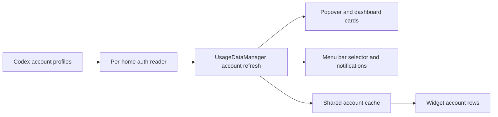

# Sessions: 2026-07-13

**Summary:** Codex multi-account usage tracking

---

## Session 1: Add Codex Multi-Account Support

**Duration:** ~1 hour
**Status:** Complete

### System flow

### Affected components

- Codex account configuration and OAuth-file resolution
- Usage refresh, cache, notifications, and status-item selection
- Popover, dashboard, Settings, and widget presentation
- Shared app-group data contract and focused tests

### What was done

- [x] Added zero-config default and persistent custom `CODEX_HOME` profiles
- [x] Fetched and preserved independent usage metrics per Codex account
- [x] Added labeled account cards, menu selection, notifications, and widget rows
- [x] Added Settings controls for account labels and home directories
- [x] Added account-store, service, orchestration, snapshot, notification, selector, and shared-cache tests
- [x] Updated implemented architecture documentation

### Key decisions

- Preserve the existing provider-level metrics cache as the compatibility representative while adding a separate labeled account cache for multi-row surfaces.
- Keep auth-file reads off the main actor for every account.
- Use deterministic account IDs and account-scoped notification keys so identical providers cannot collide.

### Files changed

- `MeterBar/Models/CodexAccount.swift` - Codex profile model and persistent store
- `MeterBar/Services/CodexCliLocalService.swift` - Account-aware auth and usage fetch
- `MeterBar/Services/UsageDataManager.swift` - Per-account orchestration and caching
- `MeterBar/App/MeterBarApp.swift` - Account-aware notifications and status selection
- `MeterBar/Views/` - Labeled Codex account presentation and settings
- `MeterBarWidget/UsageWidget.swift` - Account-aware widget rows
- `Packages/MeterBarShared/` - Shared labeled account snapshot contract
- `MeterBarTests/` - Focused multi-account regression coverage
- `.agents/SYSTEM/ARCHITECTURE.md` - Current multi-account architecture

### Mistakes and fixes

- Initial notification changes were inserted at the wrong matching loop; moved them into the notification evaluator before verification.
- The first Settings refresh gate depended on the default account; changed it to refresh all configured profiles.

### Next steps

- [ ] Review and merge the pull request after CI passes

---

**Total sessions today:** 1
