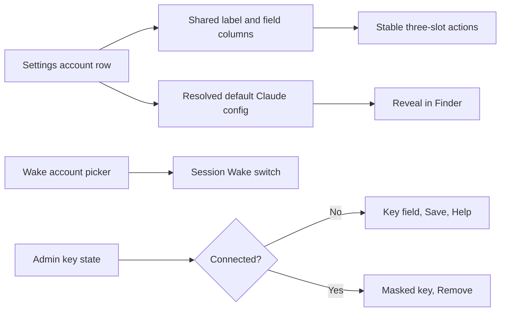

# Sessions: 2026-07-13

**Summary:** Settings polish for issue #146

---

## Session 1: Settings polish pass

**Duration:** ~30 minutes
**Status:** Complete

### System Flow

### Affected components

| Layer | Components |
|---|---|
| Settings UI | Claude account rows, API key rows, Session Wake pane |
| Model utility | Default Claude config-directory resolution |
| Tests | Claude config-directory resolution fixtures |

### What was done

- [x] Aligned Claude account name/config columns and fixed action slots.
- [x] Added default-config explanatory copy and Finder reveal action.
- [x] Moved the wake-account prerequisite above an explicit switch-style toggle.
- [x] Added connected/disconnected progressive disclosure for admin keys.
- [x] Added focused path-resolution tests and passed strict SwiftLint/diff checks.

### Files changed

- `MeterBar/Models/ClaudeCodeAccount.swift` - resolves the effective default Claude config directory.
- `MeterBar/Views/SettingsView.swift` - account-row and admin-key UI polish.
- `MeterBar/Views/SessionWakeSettingsView.swift` - prerequisite ordering and switch style.
- `MeterBarTests/ClaudeCodeAccountStoreTests.swift` - default-path resolution coverage.

### Key decisions

- **Decision:** Match the existing `CodexHomeDirectory` injectable resolver pattern inside the existing Claude account model.
  - **Rationale:** Keeps environment handling deterministic and testable without introducing another service.
- **Decision:** Reserve the unavailable default-profile delete action with an accessibility-hidden layout slot.
  - **Rationale:** All visible actions remain aligned without exposing an inert control.

### Mistakes and fixes

_None._

### Next steps

- [ ] Let pull-request CI run tests, coverage, and Xcode builds under the workstation safety policy.

---

**Total sessions today:** 1
