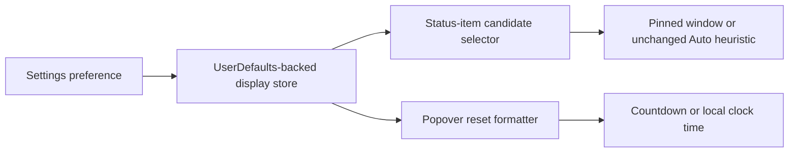

# 2026-07-14 — Fix broken Claude Code usage (OAuth primary)

## Problem
`claude /usage` (CLI 2.1.208) only renders the usage screen in an interactive TTY.
Every headless spawn a GUI app can make returns a session **cost summary**
(`Total cost: $0.0000 …`), so `ClaudeCodeCLIUsageParser` found no usage windows →
`parsingFailed("No Claude usage windows found.")` → the card showed "Refresh failed".
#156's parse-health surfaced it; #145 fixed only a separate PATH hook error.

## Research (option 1 — authenticated API)
- Confirmed the live source Claude Code's own `/usage` screen reads:
  `GET https://api.anthropic.com/api/oauth/usage` with the `Claude Code-credentials`
  Keychain OAuth token (`Authorization: Bearer`, `anthropic-beta: oauth-2025-04-20`).
  Response: `five_hour` / `seven_day` / `seven_day_sonnet` windows (`utilization`,
  `resets_at`) + `extra_usage`.
- Verified dead-ends from the brief: no `usage`/`status` subcommand;
  `-p "/usage" --output-format json` runs an empty session; PTY makes `claude` hang.
- **Key finding:** MeterBar already implemented this exact endpoint in
  `ClaudeCodeLocalService` — but gated behind the opt-in `ClaudeCodeEnableOAuthFallback`
  flag and only tried *after* the (broken) CLI path failed.

## Fix
Promoted OAuth from "legacy fallback" to the **primary** source:
- `ClaudeCodeLocalService.fetchUsageMetrics` now tries `/api/oauth/usage` first for
  the **default account** (`fetchUsageViaOAuth` returns `nil` ⇒ CLI fallback; throws
  on a real network/decode error rather than retrying the headless-broken CLI).
  Custom (`CLAUDE_CONFIG_DIR`) accounts stay CLI-only (no Keychain token).
- Extracted pure, tested helpers: `metrics(from:)`, `prefersOAuth(account:oauthEnabled:)`,
  `isOAuthUsageEnabled(defaults:)` — single source of truth for the flag, now **on by
  default** (`object(forKey:) as? Bool ?? true`), routed through the two other call
  sites (`ProviderSnapshot`, `ProviderReadinessInspector`).
- Renamed `ClaudeCodeUsageSource.legacyOAuth` → `.oauth`; refreshed Settings copy.
- Option 3 as a bonus: `ClaudeCodeCLIUsageParser` now detects the cost-summary shape
  and throws a legible error instead of the vague "No usage windows found."

## Tests (TDD-first)
- `ClaudeCodeOAuthUsageTests` — mapping, source policy, enabled-by-default flag.
- `ClaudeCodeCLIUsageParserTests.testDetectsCostSummaryInsteadOfUsageScreen`.
- Existing decode contract tests already cover the wire model.

## Tradeoff
Enabling OAuth by default means one **one-time macOS Keychain prompt** on first launch
of a signed release (the grant persists across Sparkle updates). Opt out via Settings ▸
Claude Code ▸ "Claude Code OAuth usage" (dev builds re-prompt per rebuild).

## Follow-up (out of scope)
`WakeQuotaAuthority`/`LiveWakeQuotaProvider` still call the raw CLI service; the
session-wake default-account quota gate would also benefit from OAuth, but needs a
**side-effect-free** OAuth fetch to avoid coupling UI `@Published` state into wake decisions.

---

# 2026-07-14 (pt 2) — Menu bar display preferences (#142)

## System flow

## What was done

- Added persistent Auto/pinned provider-account-window selection with stable pin keys.
- Preserved the legacy Auto candidate keys and selector pool so default behavior and tie-breaks do not change.
- Added percentage-left, percentage-used, icon-only, compact, and regular status-item presentation options.
- Added countdown/local-clock reset formatting across normal, detail, and exhausted popover cards.
- Added focused tests for persistence, selector precedence/fallback, stable option keys, labels, and reset formatters.

## Key decisions

- Unavailable pins remain persisted but temporarily fall back to Auto, so disabling a provider does not erase intent.
- Compact percentage-left plus countdown remains the default and renders the same status title, tooltip, and selector behavior as before.
- Activity probes still run once per account off-main; their result is shared across that account's pin-capable windows.

## Verification

- `swiftlint lint --strict --quiet` — passed.
- `git diff --check` — passed.
- Local tests/builds skipped by the MacBook verification rule; PR CI is the execution gate.
- `swiftformat --version` — blocked because SwiftFormat is not installed.

## Mistakes and fixes

- The first fetch refspec used an unbraced zsh variable before `:refs`; corrected it with `${DEFAULT_BRANCH}` before any fetch occurred.
- A read-only shell loop used zsh's special `path` variable; renamed it and reran successfully with no repository changes.
- Initial pin keys would have changed Auto's equal-quota tie-break; separated persistent pin identity from the legacy sticky key.

## Next steps

- [ ] Let PR CI run tests, coverage, app/widget/CLI builds, lint, and secret scan.
