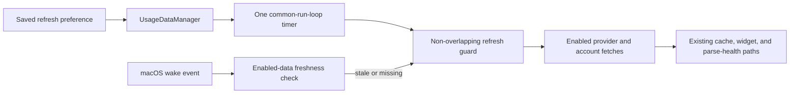

# 2026-07-17

## Session 1: Ten-minute resident usage refresh (#211)

**Status:** Implementation complete; PR CI pending

### Affected components

- Refresh interval preference and Settings picker
- Usage refresh orchestration and overlap protection
- macOS application wake lifecycle
- Focused refresh scheduling tests and current documentation

### What was done

- Added a 10-minute interval and made it the default only when no valid saved preference exists.
- Preserved existing 1, 2, 5, 15, 30-minute, and manual-only selections.
- Kept `UsageDataManager` as the cadence owner with one main-run-loop timer in common modes.
- Coalesced overlapping full and provider-specific refresh requests through the existing loading state.
- Forwarded the macOS wake notification to a stale-data policy that refreshes enabled sources once when data is missing or at least 10 minutes old.
- Added focused coverage for defaults, migration, timer cadence, overlap, stale wake catch-up, fresh wake behavior, and manual-only mode.

### Key decisions

- Wake freshness uses the oldest enabled provider/account snapshot so one fresh source cannot hide another stale source.
- Disabled or inaccessible sources do not force wake catch-up; missing data for an enabled source does.
- Timer ticks are not replayed after sleep. The wake path requests at most one catch-up cycle, and the overlap guard handles a delayed timer racing the wake event.

### Verification

- `swiftlint lint --strict --quiet` on all changed Swift and test files — passed.
- `git diff --check` — passed.
- SwiftFormat — unavailable locally.
- Swift tests, typechecks, and Xcode builds — skipped locally per the MacBook safety rule; PR CI is the execution gate.
- Claude Opus 4.8 high-effort review — unavailable after two attempts; the retry returned `API Error: 529 Overloaded`.

### Next steps

- [ ] Let PR CI run focused tests, coverage, lint, secret scan, and app/widget/CLI builds.
