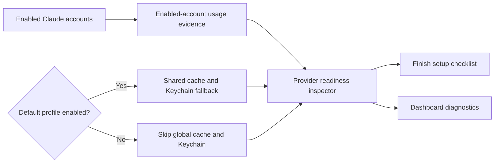
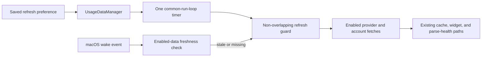

# 2026-07-17 — Account-scoped Claude readiness

## Session 1: Ignore disabled default-profile authentication

**Status:** Complete; PR CI pending

### Affected components

- Claude provider readiness gathering
- Menu-bar setup checklist invalidation
- Dashboard diagnostics error selection
- Provider readiness regression coverage

### What was done

- Scoped recent-usage evidence to enabled Claude accounts.
- Prevented global Claude Keychain inspection when the default profile is disabled.
- Preserved the shared-cache cold-start fallback when the default profile remains enabled.
- Excluded stale default-profile refresh errors from dashboard readiness after disabling that profile.
- Re-ran popover readiness when enabled-account freshness changes, with cancellation-safe state publication.
- Added coverage for authenticated, missing, stale, disabled-default, and forwarding cases.

### Key decisions

- The global Keychain and shared-cache identity belong only to the default profile, so both are gated by its enabled state.
- Custom-profile failures remain represented by their account cards; they do not reuse or masquerade as default-profile authentication failures.
- The CLI doctor keeps its existing default-profile behavior through default inspector arguments.

### Files changed

- `MeterBar/Services/ProviderReadinessInspector.swift`
- `MeterBar/Views/MenuBarView.swift`
- `MeterBar/Views/UsageDashboardView.swift`
- `MeterBarTests/ProviderReadinessInspectorTests.swift`

### Verification

- SwiftLint strict passed on all changed Swift files.
- `git diff --check` passed.
- Claude Opus 4.8 high-effort review completed in three passes; safe in-scope findings were applied.
- SwiftFormat was unavailable locally.
- Swift tests and Xcode builds were not run locally per the MacBook policy; PR CI is the execution gate.

### Mistakes and fixes

- The first readiness draft discarded valid shared-cache evidence when per-account memory was empty after launch. Review caught it, and the final logic uses shared cached evidence only while the default profile is enabled.
- The first invalidation task could publish an older detached result after cancellation. The final task checks cancellation before mutating view state.

### Next steps

- [ ] Confirm PR CI tests, coverage, app/widget/CLI builds, lint, and secret scan.
# 2026-07-17 — Multi-account quota UI follow-ups

## Session 1: Bound widget rows and isolate enabled Codex profiles

**Status:** Complete; PR CI pending

### What changed

- Count every enabled Codex and Claude profile in the dashboard overview, plus each enabled single-account provider.
- Exclude disabled Codex profiles from provider cards, status-item probes, refreshes, aggregate metrics, and widget snapshots.
- Keep Codex graceful degradation account-scoped so cached quota data cannot move between profile labels.
- Bound the medium widget to three row slots, using two rows plus a `+N more` summary when usage sources overflow.
- Add regression coverage for source counts, disabled/all-disabled/profile-switched Codex accounts, and widget row budgeting.

### Verification

- Focused SwiftLint strict: zero violations on all changed Swift files.
- `git diff --check`: clean.
- Claude Opus 4.8 high-effort review completed; all correctness findings applied and the final profile-isolation verdict passed.
- Local XCTest and Xcode build skipped per MacBook policy; PR CI is the broad validation gate.
- SwiftFormat unavailable locally.

### Files changed

- `MeterBar/App/MeterBarApp.swift`
- `MeterBar/Services/UsageDataManager.swift`
- `MeterBar/Views/ProviderSnapshot.swift`
- `MeterBar/Views/UsageDashboardView.swift`
- `MeterBarWidget/UsageWidget.swift`
- `Packages/MeterBarShared/Sources/MeterBarShared/MediumWidgetRowBudget.swift`
- Focused tests under `MeterBarTests/`

## Session 2: Ten-minute resident usage refresh (#211)

**Status:** Implementation complete; PR CI pending

### Affected components

- Refresh interval preference and Settings picker
- Usage refresh orchestration and overlap protection
- macOS application wake lifecycle
- Focused refresh scheduling tests and current documentation

### What was done

- Added a 10-minute interval and made it the default only when no valid saved preference exists.
- Preserved existing 1, 2, 5, 15, 30-minute, and manual-only selections.
- Kept `UsageDataManager` as the cadence owner with one main-run-loop timer in common modes.
- Coalesced overlapping full and provider-specific refresh requests through the existing loading state.
- Forwarded the macOS wake notification to a stale-data policy that refreshes enabled sources once when data is missing or at least 10 minutes old.
- Added focused coverage for defaults, migration, timer cadence, overlap, stale wake catch-up, fresh wake behavior, and manual-only mode.

### Key decisions

- Wake freshness uses the oldest enabled provider/account snapshot so one fresh source cannot hide another stale source.
- Disabled or inaccessible sources do not force wake catch-up; missing data for an enabled source does.
- Timer ticks are not replayed after sleep. The wake path requests at most one catch-up cycle, and the overlap guard handles a delayed timer racing the wake event.

### Verification

- `swiftlint lint --strict --quiet` on all changed Swift and test files — passed.
- `git diff --check` — passed.
- SwiftFormat — unavailable locally.
- Swift tests, typechecks, and Xcode builds — skipped locally per the MacBook safety rule; PR CI is the execution gate.
- Claude Opus 4.8 high-effort review — unavailable after two attempts; the retry returned `API Error: 529 Overloaded`.

### Next steps

- [ ] Let PR CI run focused tests, coverage, lint, secret scan, and app/widget/CLI builds.
