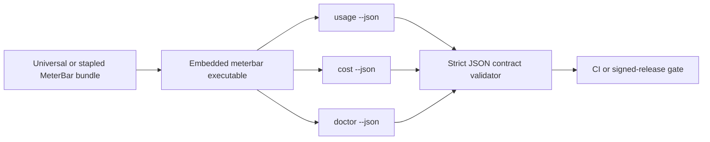

# 2026-07-17 — Multi-account quota UI follow-ups

## Session 1: Bound widget rows and isolate enabled Codex profiles

**Status:** Complete; PR CI pending

### What changed

- Count every enabled Codex and Claude profile in the dashboard overview, plus each enabled single-account provider.
- Exclude disabled Codex profiles from provider cards, status-item probes, refreshes, aggregate metrics, and widget snapshots.
- Keep Codex graceful degradation account-scoped so cached quota data cannot move between profile labels.
- Bound the medium widget to three row slots, using two rows plus a `+N more` summary when usage sources overflow.
- Add regression coverage for source counts, disabled/all-disabled/profile-switched Codex accounts, and widget row budgeting.

### Verification

- Focused SwiftLint strict: zero violations on all changed Swift files.
- `git diff --check`: clean.
- Claude Opus 4.8 high-effort review completed; all correctness findings applied and the final profile-isolation verdict passed.
- Local XCTest and Xcode build skipped per MacBook policy; PR CI is the broad validation gate.
- SwiftFormat unavailable locally.

### Files changed

- `MeterBar/App/MeterBarApp.swift`
- `MeterBar/Services/UsageDataManager.swift`
- `MeterBar/Views/ProviderSnapshot.swift`
- `MeterBar/Views/UsageDashboardView.swift`
- `MeterBarWidget/UsageWidget.swift`
- `Packages/MeterBarShared/Sources/MeterBarShared/MediumWidgetRowBudget.swift`
- Focused tests under `MeterBarTests/`

## Session 2: Built-bundle JSON contract verification

**Status:** Complete; PR CI pending

### Affected components

- Public CLI JSON integration surface
- Pull-request app-bundle verification
- Signed and stapled release verification
- CLI schema documentation

### What was done

- Added a reusable smoke validator that accepts the built `meterbar` executable and runs
  `usage --json`, `cost --json`, and `doctor --json`.
- Enforced strict, single-document JSON parsing; version 1 usage/cost data and cache-missing
  envelopes; and the exact redacted doctor DTO.
- Added fake-binary fixtures covering data, cache-missing, stderr isolation, contaminated stdout,
  and forbidden secret-bearing doctor fields.
- Added the fixture harness and real executable smoke to the CI build job.
- Added the same real executable smoke after notarization and stapling in the signed-build workflow.
- Documented the existing doctor JSON contract.

### Key decisions

- Keep the validator outside the CLI so it tests ArgumentParser wiring, output channels, bundle
  access, and the executable actually being shipped.
- Capture stdout and stderr separately. Diagnostics may remain on stderr, while any stdout
  contamination makes strict JSON parsing fail.
- Allow version 1 usage/cost data or their documented cache-missing envelopes so credential-free
  runners remain deterministic without provider calls.

### Files changed

- `.github/workflows/ci.yml`
- `.github/workflows/_build-signed.yml`
- `docs/cli-json-schema.md`
- `scripts/verify-cli-json-smoke.sh`
- `scripts/test-cli-json-smoke.sh`
- `scripts/fixtures/cli-json-smoke/fake-meterbar.sh`

### Verification

- `bash -n` passed for all three new shell scripts.
- ShellCheck passed for all three new shell scripts.
- Actionlint passed for both changed workflows.
- Embedded Python validator syntax compilation passed.
- `git diff --check` passed.
- Fixture execution, CLI builds, executable smokes, Swift tests, and Xcode builds were not run
  locally; the issue contract and MacBook safety policy delegate them to PR CI.

### Mistakes and fixes

- The Projects REST claim response omitted expanded field values, so the immediate response parser
  could not confirm the new status. A direct item re-query verified the claim as `In Progress`
  before any branch or file change.

### Next steps

- [ ] Confirm the CI fixture harness and universal built-bundle smoke pass.
- [ ] Confirm the signed workflow exercises the same validator on the stapled release artifact.
