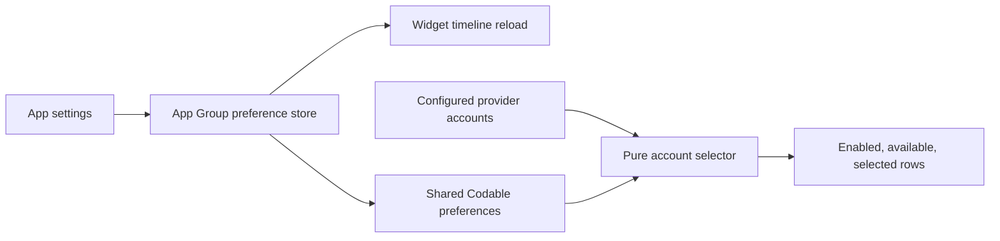

# Sessions: 2026-07-18

**Summary:** Shared widget preferences and deterministic account selection

---

## Session 1: Shared widget preference domain

**Duration:** ~30 minutes
**Status:** Complete

### System flow

### Affected components

- Shared app/widget preference model and App Group store
- Pure widget account filtering and ordering
- SwiftPM regression coverage

### What was done

- Added select-all and explicit stable account selection.
- Added used/remaining display mode, visible quota windows, reset/freshness details, and provider/urgency ordering.
- Added a pure selector that filters disabled or unavailable providers and accounts without deleting persisted intent.
- Added an injectable timeline-reload seam that fires once for each changed preference.
- Preserved the existing widget presentation as the default and left the cached-metrics wire contract unchanged.
- Added focused coverage for defaults, persistence, selection, filtering, ordering, stable identifiers, reloads, and older encodings.

### Files changed

- `Packages/MeterBarShared/Sources/MeterBarShared/WidgetPreferences.swift` - Shared preference domain, selector, and App Group store.
- `MeterBarTests/WidgetPreferencesStoreTests.swift` - Focused domain and persistence coverage.
- `.agents/sessions/2026-07-18.md` - Session record.

### Key decisions

- **Decision:** Store widget preferences in `MeterBarShared`.
  - **Context:** Both the app and widget extension must decode the same values without duplicating a contract.
  - **Rationale:** One module and one Codable representation prevent cross-target drift.
- **Decision:** Keep explicit identifiers when accounts become disabled, unavailable, or removed.
  - **Context:** Temporary account changes should not erase user intent.
  - **Rationale:** The pure selector can ignore ineligible rows now and restore them automatically if they return.
- **Decision:** Preserve weekly percentage-used provider ordering as the default.
  - **Context:** Issue #217 must not change current widget rendering before #218 applies preferences.
  - **Rationale:** Existing users retain the exact pre-preference behavior.

### Mistakes and fixes

- **Mistake:** Two initial test assertions chained a multiline selector call directly into `map`.
- **Fix:** Bound each selection result to a local value before mapping, satisfying the repository SwiftLint rule.

### Verification

- `swiftlint lint --strict --quiet Packages/MeterBarShared/Sources/MeterBarShared/WidgetPreferences.swift MeterBarTests/WidgetPreferencesStoreTests.swift` - passed.
- `git diff --check` - passed.
- SwiftFormat - unavailable locally.
- Swift tests, typechecks, and builds were not run locally per the issue's CI-only verification contract and MacBook resource policy.

### Next steps

- [ ] Let PR CI run focused tests, coverage, SwiftLint, and app/widget builds.

---

**Total sessions today:** 1
