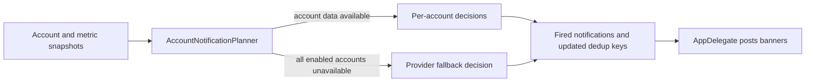

# 2026-07-18 — Extract account notification planning

## Session 1: Pure multi-account notification planner

**Status:** Complete; PR CI pending

### What was done

- Moved Claude and Codex account iteration, fallback selection, enablement cleanup,
  and sequential dedup-key threading into a pure service.
- Defined a no-duplicate namespace transition policy: switching between provider
  fallback and per-account data primes the new namespace without posting the same
  quota state again.
- Left `AppDelegate` as the side-effect adapter that gathers snapshots and posts
  returned notifications.
- Added focused coverage for account identity, fallback behavior, namespace
  transitions, provider/account disablement, stale data, unavailable accounts,
  and Claude-to-Codex key threading.

### Files changed

- `MeterBar/Services/AccountNotificationPlanner.swift`
- `MeterBar/Services/NotificationDecider.swift`
- `MeterBar/App/MeterBarApp.swift`
- `MeterBarTests/AccountNotificationPlannerTests.swift`

### Verification

- SwiftLint strict passed for all changed Swift files.
- `git diff --check` passed.
- Swift tests, typechecks, and builds were intentionally left to GitHub Actions
  under issue #224's CI-only verification contract.
