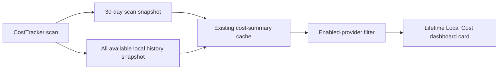

# Sessions: 2026-07-18

**Summary:** Lifetime local cost summary for issue #137

---

## Session 1: Add Lifetime Cost Summary

**Duration:** ~1 hour
**Status:** Complete; PR CI pending

### System Flow

### Affected Components

| Layer | Components |
|-------|------------|
| Models | `CostSummary`, `LifetimeCostSummary`, `LifetimeProviderCost` |
| Services | `CostTracker` local Claude and Codex scanning |
| UI | Costs dashboard lifetime summary card |
| Tests | Lifetime aggregation and cache compatibility |

### What was done

- [x] Added a pure lifetime aggregation with provider subtotals and tracked date range.
- [x] Rebuilt lifetime history from available local logs on every scan, replacing the cached snapshot instead of accumulating overlapping scans.
- [x] Stored lifetime data in the existing cost-summary cache with backward-compatible decoding.
- [x] Added a dashboard card for the lifetime total, provider reconciliation, loading, legacy-cache, and zero-history states.
- [x] Added focused model tests for multi-provider aggregation, empty and zero-cost histories, repeated scans, filtering, and cache compatibility.

### Files changed

- `MeterBar/Models/TokenCost.swift` - Added lifetime summary models and provider-aware filtering.
- `MeterBar/Services/CostTracker.swift` - Added all-history scanning and legacy-cache backfill.
- `MeterBar/Views/DashboardCostCards.swift` - Added the lifetime dashboard card.
- `MeterBar/Views/UsageDashboardView.swift` - Integrated the card into Costs.
- `MeterBarTests/LifetimeCostSummaryTests.swift` - Added focused aggregation and persistence coverage.

### Key decisions

- **Decision:** Keep the 30-day summary unchanged and add a lifetime snapshot to the same cache.
  - **Context:** Existing charts, provider breakdowns, and CLI windows rely on the current 30-day semantics.
  - **Rationale:** This preserves behavior while avoiding a second persistence path or a cache migration.
- **Decision:** Re-scan all available history and replace the lifetime snapshot.
  - **Context:** Merging overlapping 30-day scans cannot reliably deduplicate history without persisting event identities.
  - **Rationale:** A point-in-time rebuild uses the scanners' existing event deduplication and cannot compound totals across refreshes.

### Mistakes and fixes

- **Mistake:** The initial card treated a legacy cache with no lifetime field as a genuine zero-history result.
- **Fix:** Added a distinct scan-needed state and automatic background backfill for legacy caches.
- **Prevention:** Keep absence, loading, and valid-empty states explicit when extending persisted summaries.
- **Mistake:** The first local commit body preserved newline escape characters literally.
- **Fix:** Corrected the unpushed commit message before publication.

### Verification

- `swiftlint lint --strict --quiet` on all changed Swift files passed.
- `git diff --check` passed.
- Swift tests and builds were not run locally under the MacBook resource policy; PR CI is the execution gate.
- SwiftFormat is not installed locally.

### Next steps

- [ ] Let PR CI compile and run the focused lifetime-summary coverage.
- [ ] Review the lifetime card in light and dark appearances.

---

**Total sessions today:** 1
