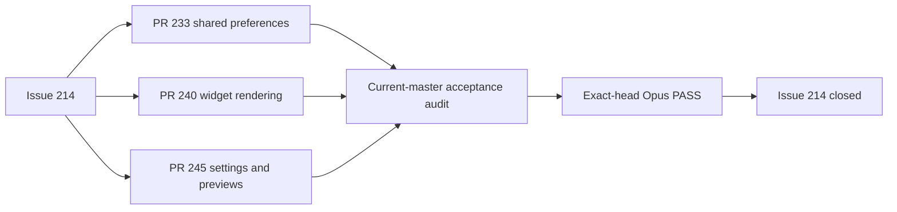

# Sessions: 2026-07-23

**Summary:** Verified and closed the completed Widget settings epic (#214)

---

## Session 1: Close Widget settings epic

**Duration:** ~30 minutes
**Status:** Complete

### System flow

### Affected components

- GitHub epic state and closure evidence
- App Group widget preferences
- Widget presentation planning and family rendering
- Widget Settings controls, previews, help, tests, and screenshots

### What was done

- [x] Confirmed the epic was intentionally decomposed into #217, #218, and #219.
- [x] Verified PRs #233, #240, and #245 are merged and their required CI checks passed.
- [x] Audited current `master` (`2e653b7`) against every parent acceptance criterion.
- [x] Visually inspected the committed Widget Settings and small, medium, and large screenshots.
- [x] Ran strict SwiftLint across the 12 relevant source and test files with zero violations.
- [x] Obtained an exact-head Opus 4.8 `PASS` with no blocking findings.
- [x] Closed #214 as completed with delivery evidence in the closing comment.

### Files changed

- `.agents/SESSIONS/2026-07-23.md` - Recorded the epic acceptance audit and closure.

### Key decisions

- **Decision:** Do not create another implementation PR for the parent epic.
  - **Context:** All executable child slices were already merged and current `master` met the parent criteria.
  - **Rationale:** A duplicate parent implementation would add churn without addressing an unmet requirement.
- **Decision:** Treat the missing `@MainActor` annotation and duplicate preview-data computation as non-blocking.
  - **Context:** Opus and the source audit found no reachable concurrency defect or user-visible performance impact.
  - **Rationale:** Neither finding blocks the shipped behavior or the epic acceptance criteria.

### Verification

- PR #233, #240, and #245 checks: tests, coverage, SwiftLint, secret scan, and universal builds passed.
- Required screenshots exist at their expected dimensions and are legible.
- Focused current-head SwiftLint: zero violations.
- `git diff --check`: passed.
- Exact-head Opus 4.8 review for `2e653b7e60513996d6455e35a9e08ac3bd2eea3f`: `PASS`.
- Local tests, typechecks, and builds were intentionally not run under the MacBook verification policy.

### Mistakes and fixes

- **Issue:** Fable planning returned HTTP 429 and the single Opus planning fallback produced no usable output.
- **Resolution:** Recorded `planning_degraded` and used the bounded Sol fallback plan as required.
- **Issue:** The first orchestrated exact-head Opus call completed without surfacing its JSON result.
- **Resolution:** Re-ran the same evidence-bound review through the direct shell path, which returned a valid structured `PASS`.

### Next steps

- None for #214. Two low-priority cleanup ideas remain: enforce `WidgetPreferencesStore` actor isolation and avoid duplicate preview-data computation.

---

**Total sessions today:** 1
