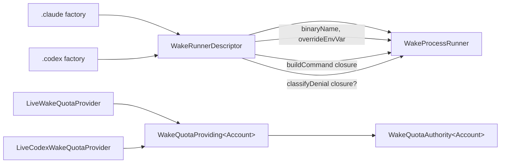

# 2026-07-24

## Session 1: DRY the Session Wake provider runners

**Status:** Implementation complete; SwiftLint clean; PR CI + exact-head Opus verification pending



### Affected components

- Session Wake process-execution seam (`WakeExecuting`)
- Session Wake quota-authority seam (fail-closed gate)
- Provider runtimes (Claude, Codex) and their orchestration call sites
- Wake unit tests

### Root cause / motivation

- Two near-identical provider runners (`WakeProcessRunner` for Claude, `CodexWakeProcessRunner` for Codex) shared ~170 lines of structure — revalidate cwd, take the lock, spawn with an argv, enforce timeout, honor cancellation, record a metadata-only log line — differing only along four axes: binary name, override env var, command builder, and an optional denial classifier.
- Two near-identical quota authorities (`WakeQuotaAuthority`, `CodexWakeQuotaAuthority`) differed only by account type.

### What was done

- Introduced `WakeRunnerDescriptor` — a `Sendable` value holding exactly the four axes that differ: `binaryName`, `overrideEnvVar`, a `@Sendable buildCommand` closure, and an optional `@Sendable classifyDenial` closure.
- Collapsed both runners into one generic `WakeProcessRunner: WakeExecuting` parameterized by a descriptor; added `.claude(...)` and `.codex(...)` static factories preserving every prior default argument.
- Made the quota seam generic: `WakeQuotaProviding<Account>` (primary associated type) and `WakeQuotaAuthority<Account>`, with `LiveWakeQuotaProvider` (Claude) and `LiveCodexWakeQuotaProvider` (Codex) as the two providers.
- Folded the Claude permission-denial classification into the Claude descriptor's `classifyDenial`; Codex's classifier is `nil` (its `approval_policy=never` runs can't stop at a permission gate, so a non-zero exit is always a plain failure).
- Repurposed `CodexWakeProcessRunner.swift` and `CodexWakeQuotaAuthority.swift` in place (removed their now-redundant types, kept the files) so all three build systems — the Xcode project's explicit membership, the root `Package.swift` glob, and the CLI `Package.swift` glob — stay in sync without any `.pbxproj`/manifest edits.
- Updated every call site (`ClaudeWakeRuntime`, `CodexWakeRuntime`, `WakeCLIEngine`, `WakeCoordinator`, `SessionWakeController`, `SessionWakeAgent`, `SessionWakeCLI`) to the generic authority type and the runner factories.
- Kept and adapted the existing wake tests; added focused descriptor-shape tests plus a Codex-runner argv/env/denial-as-failure test.

### Key decisions

- Parameterize only the four axes that genuinely differ — no speculative abstraction over the shared spawn/lock/timeout/log spine.
- Preserve behavior bug-for-bug: the Claude denial gate keys off the **raw requested** `permissionMode` (not the effective/acknowledged mode), so that exact `permissionMode != .bypass` guard lives inside the Claude classifier.
- Retain the lossy UTF-8 decode (with its `swiftlint:disable optional_data_string_conversion` wrap) for the bounded capture — strict decoding would drop a whole capture truncated mid-multibyte, disabling classification in exactly the long-output case the bounded sink exists for.
- Repurpose-in-place rather than delete files, to avoid touching three separate build manifests and risking drift between them.

### Verification

- Implementation delegated to Codex GPT-5.6 Sol at high effort with a self-contained contract (Codex is blind to the session); the main model planned, designed, and verified.
- `swiftlint lint --strict --quiet` (the exact CI command) passed with exit 0, no output.
- Full `git diff` reviewed against `master`: 16 modified files only; no added/deleted/untracked files; no `.pbxproj`/`Package.swift` changes.
- Outcome strings confirmed byte-for-byte preserved for both providers (`<bin> exited with status N`, `<bin> terminated by signal N`, `session timed out`, `<bin> binary not found`).
- Removed symbols (`CodexWakeProcessRunner`, `CodexWakeQuotaAuthority`, `CodexWakeQuotaProviding`) and the legacy `mapOutcome(_:permissionMode:)` confirmed fully absent.
- Local builds, tests, and typechecks skipped under the MacBook verification policy; PR CI is the execution gate.

### Files changed

- `MeterBar/SessionWake/WakeProcessRunner.swift` — generic runner + descriptor + `.claude` factories.
- `MeterBar/SessionWake/CodexWakeProcessRunner.swift` — repurposed to Codex descriptor + `.codex` factory (struct removed, file retained).
- `MeterBar/SessionWake/WakeQuotaAuthority.swift` — generic `WakeQuotaProviding<Account>` + `WakeQuotaAuthority<Account>`.
- `MeterBar/SessionWake/CodexWakeQuotaAuthority.swift` — repurposed to `LiveCodexWakeQuotaProvider` only (protocol + authority removed, file retained).
- `MeterBar/SessionWake/ClaudeWakeRuntime.swift`, `CodexWakeRuntime.swift`, `WakeCLIEngine.swift`, `WakeCoordinator.swift` — generic authority typing + runner factory wiring.
- `MeterBar/SessionWake/SessionWakeController.swift`, `SessionWakeAgent.swift`, `SessionWakeCLI.swift` — runner factory call sites.
- `MeterBarTests/WakeRunnerTests.swift`, `CodexWakeQuotaTests.swift`, `WakeCLIEngineTests.swift`, `WakeCoordinatorTests.swift`, `CodexSessionDiscoveryTests.swift` — adapted + new coverage.
- `.agents/SESSIONS/2026-07-24.md`

### Next steps

- [ ] Require green CI on the pushed head.
- [ ] Require an exact-head Opus 4.8 PASS before merge.

---

## Session 2: Demo / sample-data mode

**Status:** Implementation + TDD complete; SwiftLint pending; PR CI + exact-head Opus verification pending

```mermaid
flowchart LR
    Env[METERBAR_DEMO=1] --> Gate{DemoMode.isActive}
    Pref[Hidden prefs toggle<br/>StorageKeys.demoMode] --> Gate
    Gate -->|off, default| Real[Real cached data +<br/>live provider scans]
    Gate -->|on| Fixture[DemoData fixture]

    Fixture --> UDM[UsageDataManager.shared<br/>@Published metrics]
    Fixture --> CT[CostTracker.shared<br/>costSummary]
    Fixture --> Stores[Codex/ClaudeCode AccountStore<br/>.defaultAccount only]

    UDM --> Overview[UsageDashboardView]
    UDM --> Menu[MenuBarView]
    UDM --> Planner[WidgetPresentationPlanner]
    Planner --> Widget[Medium widget]
    CT --> Costs[Overview cost cards]

    Script[render-readme-screenshots.swift<br/>standalone, mirrored fixture] --> PNG[menubar.png +<br/>widget-medium.png]
```

### Affected components

- App-UI data seam (`UsageDataManager.shared`) — Overview window + menu-bar panel
- Cost seam (`CostTracker.shared`) — Overview cost cards
- Account-store seams (`CodexAccountStore`, `ClaudeCodeAccountStore`) — generic card titles
- Widget presentation (`WidgetPresentationPlanner`) — medium widget rows
- Standalone landing-page screenshot renderer (`scripts/render-readme-screenshots.swift`)

### Root cause / motivation

- The only screenshot path for meterbar.dev used the owner's **live** account: ~$13k/30-day cost, private project names, all-red "Critical/Out/deficit" quota bars — unusable and off-message for a landing page.
- No populated first-run experience: a new user sees an empty MeterBar before connecting any provider.

### What was done

- **Toggle** (`DemoMode`, nonisolated enum): launch var `METERBAR_DEMO` (truthy `1/true/yes/on`, case- and whitespace-insensitive) OR hidden pref `StorageKeys.demoMode`. Off by default; `isEnabled(environment:defaults:)` is injectable for tests.
- **Fixture** (`DemoData`, in `MeterBarShared`, nonisolated, `Sendable` value types): three generic providers — Claude Code (42/58/34, model window "Fable"), OpenAI Codex (61/**82**/12, banked reset credits 2), Cursor (dollar-mapped, no window). Exactly one amber "tight" band (Codex weekly 82%), zero red, all windows read reserve/on-pace, `lastUpdated == now` (always fresh). Cost companion (`DemoData+Cost.swift`, app target since `CostSummary` lives there): total **$204.90** / 30 days, empty model+origin breakdowns, no lifetime, 30×2 daily token rows (Cursor excluded — dollar-billed).
- **Seams**: all gated at `.shared` singleton construction on `DemoMode.isActive`, so no runtime branching leaks into hot paths and **real cache/logs are never read or written** in demo mode. `refreshAll()`/`refresh(_:)`/scan/save all early-return under demo. Account stores project `[.defaultAccount]` only (read-only; never touch real `.standard` data) → guarantees generic "Codex"/"Claude" titles.
- **Widget**: the medium widget is a **separate process** (an env var can't reach it), so coverage is proven by a `WidgetPresentationPlanner.makePresentation` unit test over `DemoData.metrics`, not by writing the app group — demo mode deliberately does **not** clobber the shared cache.
- **Screenshots**: aligned the standalone renderer's hard-coded fixture to mirror the `DemoData` scenario (same headline percentages, single amber, generic labels) with a cross-reference comment tying the two together.
- **TDD**: tests written first — `DemoDataTests`, `DemoModeTests`, a widget-presentation demo case, plus demo cases added to `UsageDataManagerTests` (synthetic metrics + shared store stays empty + refresh outcomes `.skipped`) and `CostTrackerTests` (non-alarming summary, no scan).

### Key decisions

- **Gate at singleton construction, not per-call.** One branch at `.shared` init keeps the demo path fully out of the real data/scan code and makes "never touches real data" a structural guarantee, not a runtime discipline.
- **Fixture lives in `MeterBarShared`** (nonisolated, tools 5.9, no default MainActor) so the same value types are reachable from app + widget + CLI; the **cost** fixture is app-side because `CostSummary`/`TokenCost` live in the app target, not Shared.
- **Prove the widget via the planner unit, not the app group.** The widget process can't see the env var; writing the app group would risk clobbering a real user's cache. A planner test over `DemoData.metrics` is the correct, non-destructive coverage.
- **Keep the screenshot renderer standalone** (single `swiftc`, no app link) but mirror its fixture to `DemoData` with an explicit "keep in lockstep" comment — avoids coupling the render script to the app build while keeping screenshots on-message.
- **Non-alarming numbers on purpose**: mostly green + exactly one amber, ~$205 total — reads as a healthy, in-control product, not a crisis dashboard.

### Files changed

- `Packages/MeterBarShared/Sources/MeterBarShared/DemoData.swift` — fixture (new).
- `MeterBar/Models/DemoMode.swift` — toggle (new).
- `MeterBar/Models/DemoData+Cost.swift` — cost fixture (new).
- `MeterBar/Models/StorageKeys.swift` — `demoMode` key.
- `MeterBar/Services/UsageDataManager.swift` — demo gate at `shared` + refresh short-circuits.
- `MeterBar/Services/CostTracker.swift` — demo gate at `shared` + scan/save short-circuits.
- `MeterBar/Models/CodexAccount.swift`, `ClaudeCodeAccount.swift` — default-only projection under demo.
- `scripts/render-readme-screenshots.swift` — fixture aligned to `DemoData` + cross-reference comment.
- `MeterBarTests/DemoDataTests.swift`, `DemoModeTests.swift` (new); `WidgetPresentationTests.swift`, `UsageDataManagerTests.swift`, `CostTrackerTests.swift` (demo cases added).
- `.agents/SESSIONS/2026-07-24.md`

### Verification

- TDD: tests authored before/alongside the seams; assertions lock every invariant (single amber, no red, fresh, generic labels, empty breakdowns, shared store untouched, refresh skipped).
- SourceKit flagged transient "inaccessible init / extra argument" diagnostics on the test files — diagnosed as index-lag against pre-edit indexes (the real inits carry the new params); resolves at build.
- Local builds/tests/typechecks skipped under the MacBook verification policy; PR CI (macos-26 / Xcode 26.2) is the execution gate. The screenshot renderer is a `swiftc` build+run and was **not** run locally for the same reason.

### Screenshot regeneration

- Menu + medium widget PNGs (`docs/screenshots/menubar.png`, `widget-medium.png`): run
  `./scripts/render-readme-screenshots.sh` on a Mac with full Xcode.
- Overview window + live surfaces: launch the app with `METERBAR_DEMO=1` and capture the Overview window.

### Next steps

- [ ] `swiftlint lint --strict --quiet` on the pushed head (via CI).
- [ ] Require green CI on the pushed head.
- [ ] Require an exact-head Opus 4.8 PASS before merge.
- [ ] Regenerate `docs/screenshots/*.png` on a Mac with full Xcode and hand off to the landing repo.
